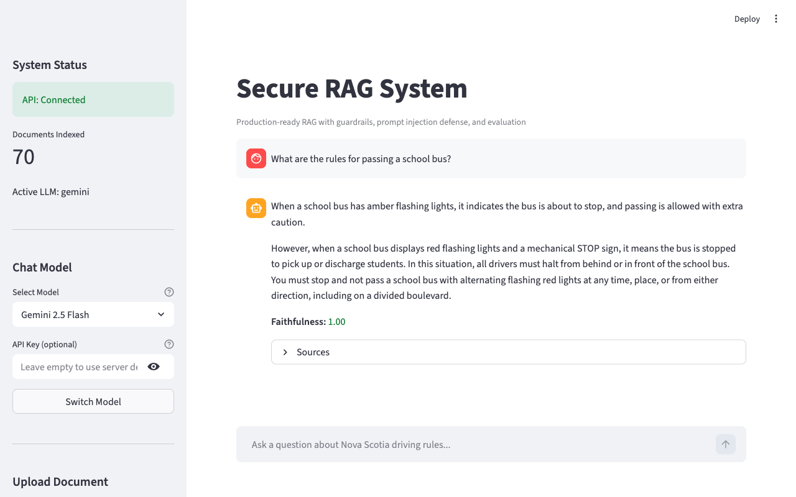
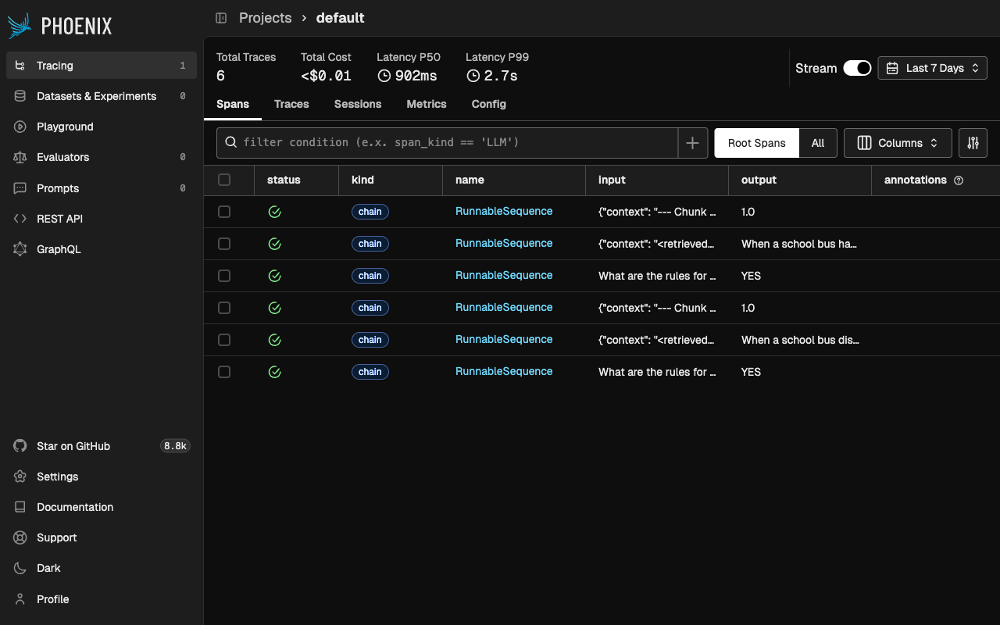

# Secure RAG System

[](https://www.python.org/downloads/)
[](https://fastapi.tiangolo.com)
[](https://www.docker.com/)
[](LICENSE)

Production-ready Retrieval-Augmented Generation (RAG) system with 5-layer prompt injection defense, input/output guardrails, faithfulness evaluation, and full observability. Built for document Q&A over PDF files.

## Architecture

```
                          Streamlit UI (:8501)
                               |
                          FastAPI (:8000)
                               |
User Query ─────────────────────────────────────────────────────── Secure Response
       |                                                                |
  [INPUT GUARDRAILS]                                          [FAITHFULNESS EVAL]
   - Query length                                              - LLM-based scoring
   - PII detection                                             - Retrieval relevance
   - Off-topic check                                                    |
       |                                                     [OUTPUT VALIDATION]
  [PROMPT DEFENSES]                                            - Leak detection
   - Jailbreak detection                                       - Length cap
   - Input sanitization                                                 |
   - 11 injection patterns                                    [LLM GENERATION]
       |                                                       - Hardened prompt
  [EMBED & RETRIEVE]                                           - Timeout guard
   - Vector similarity search           ◄──────────────────           |
   - Confidence threshold                                    [CONTEXT WRAPPING]
       |                                                       - XML delimiters
       └───────────────────────────────────────────────────────────────┘

                     Phoenix Traces (:6006)
```

## Quick Start

### Option 1: Docker (recommended)

```bash
# Clone and configure
git clone <repo-url> && cd secure-rag-system
cp .env.example .env
# Edit .env with your API keys (GOOGLE_API_KEY + JINA_API_KEY)

# Launch all services
docker compose up

# Three services start:
#   - Streamlit UI:  http://localhost:8501
#   - API + Docs:    http://localhost:8000/docs
#   - Phoenix Traces: http://localhost:6006
```

### Option 2: Local Development

```bash
# Install dependencies (requires uv)
uv sync

# Create .env file
cp .env.example .env
# Edit .env with your API keys

# Start the API server
python main.py --serve

# In another terminal, start the UI
uv run streamlit run ui/app.py
```

### CLI Mode

```bash
# Interactive Q&A
python main.py

# Batch queries
python main.py --batch

# Run security test scenarios
python main_secure.py

# Force re-index documents
python main.py --reindex
```

## Streamlit Chat UI

The chat UI provides:
- Chat interface for asking questions about your documents
- **Runtime model switching** — choose between Gemini, OpenAI, and Anthropic models without restarting
- Optional API key input for testing with different accounts
- Document upload via sidebar (PDF indexing)
- System health status and active LLM provider info
- Faithfulness score visualization for each answer
- Expandable source citations and security metadata
- Live query metrics from the API
- Link to Phoenix tracing UI



## API Reference

### `POST /api/v1/query`

Ask a question.

```bash
curl -X POST http://localhost:8000/api/v1/query \
  -H "Content-Type: application/json" \
  -d '{"question": "What are the rules for passing a school bus?"}'
```

Response includes: `answer`, `sources`, `faithfulness_score`, `guardrails_triggered`, `defenses_triggered`, `was_blocked`.

### `POST /api/v1/documents/upload`

Upload a PDF for indexing.

```bash
curl -X POST http://localhost:8000/api/v1/documents/upload \
  -F "file=@document.pdf"
```

### `POST /api/v1/switch-model`

Switch the LLM model at runtime without restarting the server.

```bash
curl -X POST http://localhost:8000/api/v1/switch-model \
  -H "Content-Type: application/json" \
  -d '{"provider": "gemini", "model": "gemini-2.5-flash"}'

# With a custom API key
curl -X POST http://localhost:8000/api/v1/switch-model \
  -H "Content-Type: application/json" \
  -d '{"provider": "openai", "model": "gpt-4o", "api_key": "sk-..."}'
```

Supported providers: `gemini`, `openai`, `anthropic`. If no `api_key` is provided, falls back to the server's environment variable.

### `GET /api/v1/health`

Health and readiness check.

```bash
curl http://localhost:8000/api/v1/health
```

### `GET /api/v1/metrics`

Query statistics and guardrail trigger counts.

```bash
curl http://localhost:8000/api/v1/metrics
```

## Configuration

All settings are loaded from environment variables or `.env` file. See `.env.example` for the complete list.

| Variable | Default | Description |
|----------|---------|-------------|
| `LLM_PROVIDER` | `gemini` | LLM provider: `gemini`, `openai`, `anthropic` |
| `LLM_MODEL` | `gemini-2.5-flash` | Model name |
| `EMBEDDING_PROVIDER` | `jina` | Embedding provider: `jina`, `openai` |
| `GOOGLE_API_KEY` | — | Required for Gemini provider |
| `JINA_API_KEY` | — | Required for Jina embeddings |
| `CHUNK_SIZE` | `1000` | Document chunk size in characters |
| `NUM_RETRIEVAL_CHUNKS` | `4` | Chunks retrieved per query |
| `CONFIDENCE_THRESHOLD` | `0.3` | Minimum retrieval relevance score |
| `API_KEY` | — | Optional API authentication |
| `RATE_LIMIT_RPM` | `60` | Rate limit (requests per minute) |
| `ENABLE_TRACING` | `false` | Enable Phoenix/OpenTelemetry tracing |
| `LOG_FORMAT` | `console` | Log format: `console` or `json` |

### Model Switching

Switch LLM providers at startup via environment variables, or at runtime via the API/UI:

**At startup** (environment variables):
```bash
# Use OpenAI
LLM_PROVIDER=openai
LLM_MODEL=gpt-4o
OPENAI_API_KEY=sk-...

# Use Anthropic
LLM_PROVIDER=anthropic
LLM_MODEL=claude-sonnet-4-5-20250929
ANTHROPIC_API_KEY=sk-ant-...
```

**At runtime** (no restart needed):
- Use the Streamlit sidebar model selector, or
- Call `POST /api/v1/switch-model` with `{"provider": "gemini", "model": "gemini-2.5-flash"}`

Available models: Gemini 2.5 Flash, OpenAI GPT-4o, Anthropic Sonnet 4.5, Anthropic Haiku 4.5.

## Security Features

### 5-Layer Prompt Injection Defense

1. **System Prompt Hardening** — Restricts LLM to driving questions only, treats retrieved context as untrusted
2. **Input Sanitization** — Regex-based detection of 11 injection patterns (instruction overrides, role changes, prompt extraction, fake system markers, jailbreak keywords)
3. **Instruction-Data Separation** — Retrieved chunks wrapped in XML delimiters; system prompt treats them as untrusted data
4. **Output Validation** — Post-generation scan for system prompt leaks or role-breaking
5. **Jailbreak Refusal** — Intercepts jailbreak attempts before they reach the LLM

### Input Guardrails

- **Query length limit** — Rejects queries >500 characters
- **PII detection** — Detects and redacts phone numbers, emails, license plates
- **Off-topic filtering** — LLM-based classification blocks non-driving questions

### Output Guardrails

- **Retrieval confidence** — Blocks answers when no relevant documents found
- **Response length cap** — Truncates excessively long responses
- **Timeout guard** — 30-second timeout on LLM generation (cross-platform)

### API Security

- Optional API key authentication via `X-API-Key` header
- Rate limiting (configurable RPM)
- CORS configuration
- PDF upload validation (magic bytes + size limit)

## Observability

When `ENABLE_TRACING=true`, the system launches [Phoenix](https://github.com/Arize-ai/phoenix) (Arize) for trace visualization:

- Automatic tracing of every LLM call, embedding call, and retriever operation
- Trace UI at `http://localhost:6006`
- Completely free — runs locally, no API key needed
- Each RAG query generates ~3 traces (off-topic check, main answer, faithfulness evaluation)

**Observed performance** (single query): P50 latency ~900ms, P99 ~2.7s, cost <$0.01 per query.



## Evaluation Metrics

1. **Faithfulness** — LLM-based scoring of answer vs context (0.0-1.0)
2. **Retrieval Relevance** — Similarity score analysis per query
3. **Refusal Accuracy** — Correct answer vs refuse decisions

## Testing

All tests use mocked LLM/embeddings — no API keys needed.

```bash
# Install dev dependencies
uv sync --dev

# Run all tests
uv run pytest -v

# Run unit tests only
uv run pytest tests/unit -v

# Run with coverage
uv run pytest --cov=src --cov-report=term-missing

# Lint
uv run ruff check src/ tests/
```

## Project Structure

```
├── main.py                    # Entry point (interactive, batch, --serve)
├── main_secure.py             # Security test scenarios runner
├── src/
│   ├── config.py              # Pydantic Settings (centralized config)
│   ├── llm_factory.py         # Model-agnostic LLM creation
│   ├── embedding_factory.py   # Model-agnostic embedding creation
│   ├── logging_config.py      # structlog configuration
│   ├── observability.py       # Phoenix + OpenTelemetry tracing
│   ├── document_loader.py     # PDF loading
│   ├── text_splitter.py       # Document chunking
│   ├── embeddings.py          # Jina AI embeddings
│   ├── vector_store.py        # ChromaDB vector store
│   ├── retriever.py           # Document retrieval + formatting
│   ├── rag_chain.py           # Basic RAG chain
│   ├── secure_rag_chain.py    # Secure RAG with all defenses
│   ├── guardrails.py          # Input/output guardrails
│   ├── prompt_defense.py      # 5-layer injection defense
│   ├── evaluation.py          # Quality evaluation metrics
│   ├── logger.py              # Security event dashboard
│   └── api/
│       ├── app.py             # FastAPI application
│       ├── routes.py          # API endpoints
│       ├── schemas.py         # Request/response models
│       ├── dependencies.py    # Dependency injection
│       └── middleware.py      # Request ID, timing
├── ui/
│   └── app.py                 # Streamlit chat UI
├── tests/
│   ├── conftest.py            # Shared fixtures (mock LLM/embeddings)
│   ├── unit/                  # Unit tests (guardrails, defenses, config)
│   └── integration/           # Integration tests (API, pipeline)
├── Dockerfile                 # Container build
├── docker-compose.yml         # Docker orchestration
├── .github/workflows/ci.yml   # CI pipeline
└── data/                      # PDF documents for Q&A
```

## Tech Stack

| Component | Technology |
|-----------|-----------|
| LLM | Google Gemini / OpenAI / Anthropic (configurable) |
| Embeddings | Jina AI v3 / OpenAI (configurable) |
| Vector Store | ChromaDB (local, persistent) |
| Framework | LangChain LCEL |
| API | FastAPI + Uvicorn |
| UI | Streamlit |
| Logging | structlog (JSON/console) |
| Tracing | Phoenix (Arize) + OpenTelemetry |
| Config | Pydantic Settings |
| Testing | pytest |
| Linting | Ruff |
| Container | Docker + Docker Compose |
| CI/CD | GitHub Actions |
| Python | 3.13+ |
